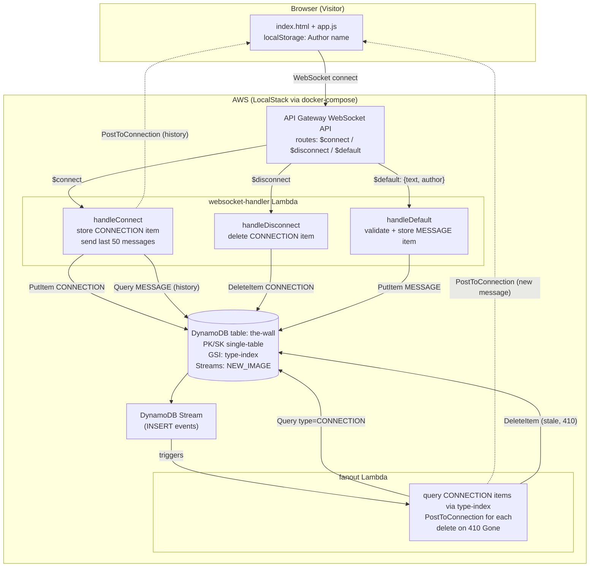

# Architecture

## Notes

- **Board**: single global DynamoDB table (`the-wall`), single-table design distinguishing `CONNECTION` and `MESSAGE` items via `PK`/`type`.
- **Fan-out decoupling** ([ADR 0001](adr/0001-fanout-via-dynamodb-streams.md)): the write path (`websocket-handler`) only persists Messages; delivery to all Connections happens asynchronously in a separate `fanout` Lambda triggered by DynamoDB Streams, so slow/failing delivery can't block or fail writes.
- **Infra as code** ([ADR 0002](adr/0002-terraform-for-infrastructure.md)): Terraform provisions API Gateway, Lambdas, IAM roles, and DynamoDB against LocalStack (`docker-compose.yml`), chosen over SAM/CDK for tooling consistency.
- Stale connections (410 Gone from `PostToConnectionCommand`) are cleaned up lazily by the `fanout` Lambda rather than proactively on disconnect failure.
